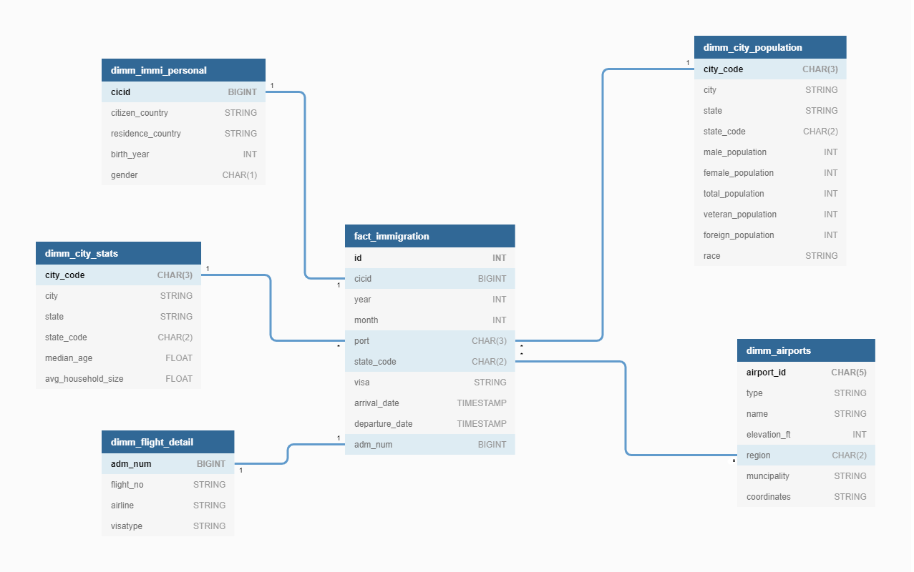

# Project: Data Engineering Nano Degree Capstone Project:
## Project Introduction:
This is my capstone project for [Data Engineering Nano Degree program](https://www.udacity.com/course/data-engineer-nanodegree--nd027?gclid=CjwKCAjw2P-KBhByEiwADBYWCtJi6nsA-_F3xHFbiqbmsxIefTbRt2w_UGRGsl4n-LHjtujG2uMpuBoCquoQAvD_BwE&utm_campaign=12908932988_c&utm_keyword=%2Budacity%20%2Bdata%20%2Bengineer_b&utm_medium=ads_r&utm_source=gsem_brand&utm_term=124509203751) offered on Udacity. This was an open ended project in which I had to implement skills I learnt from the program in a practical sense to collect and create an ETL pipeline for that data according to my choice of data model.

In this project I built an ETL pipeline to extract data from different sources clean and transform it to a useful and easy to understand star schema and saved it for future usage.

The project follows the following steps which are mentioned in detail in Capstone Project Submission.ipynb file:
-   **Step 1**: Scope the Project and Gather Data.
-   **Step 2**: Explore and Assess the Data.
-   **Step 3**: Define the Data Model.
-   **Step 4**: Run ETL to Model the Data.
-   **Step 5**: Complete Project Write Up.

## Tools:

- **AWS S3**: data storage
- **Python** for data processing
    - **Pandas** - Exploratory data analysis on small data set.
    - **PySpark** - Data processing on large data set.

## Scope 
This project will integrate I94 immigration data, Airport Codes data and US demographic data to setup a data warehouse with fact and dimension tables.

## Data Sets
- **[I94 Immigration Data](https://www.trade.gov/national-travel-and-tourism-office)**
    Data contains international visitor arrival statistics by world regions and select countries (including top 20), type of visa, mode of transportation, age groups, states visited (first intended address only), and the top ports of entry (for select countries).
- **[Airport codes Data](https://datahub.io/core/airport-codes#data)**
   This data contains the list of all airport codes, names, location, elevation etc.
- **[U.S. City Demographic Data](https://public.opendatasoft.com/explore/dataset/us-cities-demographics/export/)**
    This dataset contains information about the demographics of all US cities and census-designated places with a population greater or equal to 65,000.

    
## Conceptual Data Model
Since the purpose of this data warehouse is for OLAP and BI app usage, we modeled these data sets with star schema data modeling which is shown below.



## Project Template:
Files used on the project:

Project has two directories named  `dags`  and  `plugins`. A create tables script and readme file are at root level:
- `Capstone Project Submission.ipynb` This is Project Submission notebook file which was actually submitted for review in which all the steps are mentioned in steps for the ETL pipeline.
-   `etl.py`: Actual pipeline that reads data from source S3 bucket, processes that data using Spark, and writes to destination S3 bucket.
-  `capstone.cfg`: Contains AWS credentials and source and destination S3 buckets paths which needs to be filled before running etl.py.
- `ER_Diagram.png`: ER Diagram for star schema I created after running ETL pipeline.
- `capstone project er diagram.txt`: Commands I entered to create ER_Diagram in [dbdiagram.io](https://dbdiagram.io/home).
- `readme.md`: provides discussion on my process and decisions.
- `us-cities-demographics.csv`: U.S. City Demographic Data that comes from OpenSoft. You can read more about this data from [here](https://public.opendatasoft.com/explore/dataset/us-cities-demographics/export/).
- `airport-codes_csv.csv` airport codes data contains the list of all airport codes, names, location, elevation etc. It comes from [here](https://datahub.io/core/airport-codes#data).
- `immigration_data_sample.csv`: Contains sample for I94 immigration data  for visualization.
- `I94_SAS_Labels_Descriptions.SAS`: Contains descriptions for I94 immigration data and codes and their relevant original values.  

## Data dictionary:
#### fact_immigration_table:
immigrant log fact table:
- id ------------------------------ Autogenerated Unique id for fact table.
- cicid --------------------------- Unique id for fact table provided in original data.
- year ---------------------------- 4 digit year.
- month --------------------------- numeric month.
- port ---------------------------- city_code provided in i94 immigration data, city name can be retrieved                                     from dimm_city_population table.
- state_code ---------------------- state_code for states in US, State name can be retrieved from                                               dimm_city_population table.
- visa ---------------------------- visa cetagory.
- arrival_date -------------------- arrival timestamp for immigrant.
- departure_date ------------------ departure date for immigrant.
- adm_num ------------------------- admission number of immigrant.

#### dimm_immi_personel
personal detail for each immigrant:
- cicid ---------------------------- Unique id for fact table provided in original data.
- citizen_country ------------------ citizenship country of immigrant.
- residence_country ---------------- residence country of immigrant.
- birth_year ----------------------- birth year of immigrant.
- gender --------------------------- gender of immigrant.

#### dimm_flight_detail
flight detail for given admission number:
- adm_num ------------------------- admission number of immigrant.
- flight_no ----------------------- Number of flight.
- airline ------------------------- Airline flight belongs to.
- visatype ------------------------ Visatype of the pessenger.

#### dimm_city_stats
statistic for US cities:
- city_code ------------------------ City code for each city.
- city ----------------------------- Name of each city.
- state ---------------------------- state name of each city.
- state_code ----------------------- state code of each city.
- median_age ----------------------- median age for each city.
- avg_household_size --------------- Average household size of each city.

#### dimm_city_population:
population numbers for US cities:
- city_code ------------------------ City code for each city.
- city ----------------------------- Name of each city.
- state ---------------------------- state name of each city.
- state_code ----------------------- state code of each city.
- male_population ------------------ Male population of city.
- female_population ---------------- Female population of city.
- total_population ----------------- Total population of city.
- veteran_population --------------- Veteran population of city.
- foreign_population --------------- foreign citizens population of city.
- race ----------------------------- Majority ethnicity of city.

#### dimm_airports:
airports in United states:
- airport_id ----------------------- Airport id of airport.
- type ----------------------------- type of airport.
- name ----------------------------- name of airport.
- elevation_ft --------------------- alevation of airport in feet.
- region --------------------------- US State in which Airport is present.
- municipality --------------------- Municipality of Airport.
- coordinates ---------------------- Coordinates of Airport.

## Steps Taken:
- I imported pyspark and pandas libraries which are necessary for this project.
- I decided the scope of the project. i.e. I decided to use i94 immigration data, airport codes data and us cities damography data for my project.
- I created a spark session to work with my data.
- I loaded the datasets for my project.
- I cleaned those datasets by dropping irrelevant datam null values and duplicate values using schema on read features in pyspark.
- I also used advanced annalytics nlp methods on i9_SAS_labels_description to extract countries, cities and state names for their provided codes in the datasets.
- I replaced these codes with their relevant names where necessary in the original datasets.
- I modeled a star schema for my ETL pipeline.
- I created tables as specfied in star schema from the original datasets.
- i finalized my etl pipeline by doing data quality checks of my data warehouse.
## The Reason I finalized this data model:
I finalized this data model because I wanted to generate some beneficial OLAP cubes which would be easier to communicate with relevant authorities .e.g. some official from department of home affairs want to know how many female immigrants ported the city with highest foreign population.
### Input Test Code:
```
spark.sql("""SELECT c.city, count(f.id) as porting_female_immigrants,c.foreign_population
            FROM fact_immigration f
            LEFT JOIN dimm_city_population c
            ON f.port = c.city_code
            LEFT JOIN dimm_immi_personal p
            ON f.cicid = p.cicid
            WHERE p.gender = 'F'
            GROUP BY c.city,c.foreign_population
            ORDER BY c.foreign_population DESC
            LIMIT 1""").show()
```
### Output of test Code:
```
+--------+-------------------------+------------------+
|    city|porting_female_immigrants|foreign_population|
+--------+-------------------------+------------------+
|NEW YORK|                   192665|           3212500|
+--------+-------------------------+------------------+
```
## Data Update Frequency:
- Tables created from immigration data set should be updated monthly since the raw data set is built up monthly.
- Tables created from demography data set could be updated annually since demography data collection takes time and high frequent demography might take high cost but generate wrong conclusion.
- Table generated from airport codes data should be update annually as well, since airports are not created  or shut down overnight and frequency of new airports adding to a location is quite low.

## How to approach the problem differently under the following scenarios:
- **The data was increased by 100x.**
    If data is increased by 100x then we should consider to put data in AWS EMR which is a distributed data cluster for processing large data sets on cloud.
 
- **The data populates a dashboard that must be updated on a daily basis by 7am every day.**
    Apache Airflow is a usefull too for building up a ETL data pipeline to update the date regularly. Apache Airflow integrated with Python and AWS very well. Many applications can be combined together to deliver task automation.
- **The database needed to be accessed by 100+ people.**
    AWS Redshift is a good consideration in this case as Redshift can easily handle upto 500 connections.
